# Bank Marketing Analytics Pipeline

**MVP de Engenharia de Dados — Pós-graduação em Ciência de Dados e Analytics (PUC-Rio)**

**Autor:** Raphael Santiago · [GitHub](https://github.com/saintsago)

Pipeline de dados em nuvem, de ponta a ponta, construído no **Databricks (Free Edition)** com **arquitetura medalhão** (Bronze → Silver → Gold), **Delta Lake**, **Unity Catalog** e modelagem dimensional em **esquema estrela**. O pipeline responde a perguntas de negócio sobre campanhas de telemarketing de um banco português.


---

## Sumário

1. [Visão geral da solução](#visão-geral-da-solução)
2. [Contexto de Negócios e Perguntas (Etapa 2 e 4.1)](#1-contexto-de-negócios-e-perguntas-etapa-2-e-41)
3. [Carga dos Dados (Etapa 4.2)](#2-carga-dos-dados-etapa-42)
4. [Modelagem e Catálogo de Dados (Etapa 4.3)](#3-modelagem-e-catálogo-de-dados-etapa-43)
5. [Pipeline de Dados (Etapa 4.4)](#4-pipeline-de-dados-etapa-44)
6. [Qualidade de Dados (Etapa 4.5)](#5-qualidade-de-dados-etapa-45)
7. [Análise de Dados (Etapa 4.5)](#6-análise-de-dados-etapa-45)
8. [Autoavaliação](#7-autoavaliação)
9. [Como reproduzir](#como-reproduzir)
10. [Referências](#referências)

---

## Visão geral da solução

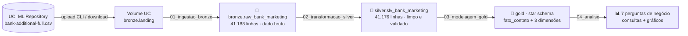
```mermaid
flowchart LR
    UCI[("UCI ML Repository<br/>bank-additional-full.csv")] -->|upload CLI / download| VOL["Volume UC<br/>bronze.landing"]
    VOL -->|01_ingestao_bronze| B["🥉 bronze.raw_bank_marketing<br/>41.188 linhas · dado bruto"]
    B -->|02_transformacao_silver| S["🥈 silver.slv_bank_marketing<br/>41.176 linhas · limpo e validado"]
    S -->|03_modelagem_gold| G["🥇 gold · star schema<br/>fato_contato + 3 dimensões"]
    G -->|04_analise| A["📊 7 perguntas de negócio<br/>consultas + gráficos"]
```

| Componente | Tecnologia |
|---|---|
| Plataforma | Databricks Free Edition (compute **serverless**) |
| Armazenamento | Delta Lake (tabelas gerenciadas) + Volume Unity Catalog (landing zone) |
| Governança / catálogo | Unity Catalog: catálogo `mvp-bank-marketing-analytics`, schemas `bronze`, `silver`, `gold` |
| Processamento | PySpark + Spark SQL |
| Orquestração | Databricks Job com 4 tasks encadeadas ([`jobs/pipeline_job.json`](jobs/pipeline_job.json)) |
| Análise / visualização | Spark SQL, pandas, matplotlib, scikit-learn (árvore de decisão) |
| Desenvolvimento | VS Code + extensão Databricks + Databricks CLI |

---

## 1. Contexto de Negócios e Perguntas (Etapa 2 e 4.1)

### Problema

> **Identificar os fatores que mais influenciam a conversão das campanhas de marketing direto de um banco português, para otimizar a alocação do esforço de contato e aumentar a adesão ao produto (depósito a prazo).**

Campanhas de telemarketing são caras: cada ligação consome tempo de operador, e contatos insistentes desgastam o relacionamento. Saber **quem**, **como** e **quando** contatar permite gastar menos ligações e converter mais.

### Perguntas de negócio

| # | Pergunta |
|---|---|
| P1 | Qual é a taxa geral de conversão da campanha e como ela varia por canal de contato (cellular × telephone)? |
| P2 | Qual perfil demográfico (idade, profissão, escolaridade, estado civil) tem maior propensão a aderir? |
| P3 | O número de contatos na campanha atual impacta positiva ou negativamente a conversão? |
| P4 | Clientes contatados em campanhas anteriores convertem mais do que novos contatos? |
| P5 | Qual é o melhor mês e dia da semana para realizar contatos? |
| P6 | Os indicadores econômicos (emprego, confiança, Euribor) influenciam a decisão do cliente? |
| P7 | Qual combinação de características forma o melhor "perfil ideal" de cliente para priorizar nos próximos contatos? |

### Planejamento: como cada pergunta será respondida

| # | Dados necessários | Métrica / método | Decisão de negócio que apoia |
|---|---|---|---|
| P1 | `y`, `contact` (+ ano do contato) | Taxa de conversão geral e por canal, com controle por ano | Canal padrão das campanhas |
| P2 | `age`, `job`, `education`, `marital` | Taxa e *lift* por categoria (mínimo de 100 contatos), com controle por ano | Segmentos a priorizar ou despriorizar |
| P3 | `campaign` | Taxa por faixa de nº de contatos e adesões a cada 100 ligações | Teto de tentativas por cliente |
| P4 | `previous`, `poutcome`, `pdays` | Taxa de novos × já contatados × resultado anterior | Ordem de prioridade da base (lista quente) |
| P5 | `month`, `day_of_week` (+ ano do contato) | Taxa e volume por mês e dia; mapa ano × mês | Calendário de contatos |
| P6 | Os 5 indicadores econômicos | Taxa por faixa, correlação e série temporal | Calibrar volume e meta ao ciclo econômico |
| P7 | Perfil + canal + histórico (**sem `duration`**) | Ranking de segmentos (suporte ≥ 200) e árvore de decisão | Ranking de priorização de clientes |

**Requisitos derivados para a engenharia de dados:**
- o grão analítico é o **contato** (1 linha por cliente contatado);
- é preciso **preservar a ordem do arquivo** para reconstruir o ano, que não existe na fonte e é necessário para separar efeitos de período (P1, P2, P5, P6);
- o `pdays` precisa de tratamento cuidadoso, porque define quem é "cliente novo" (P4);
- `duration` precisa ser marcada como *data leakage* no catálogo, para não ser usada em P7;
- como a fonte é estática, basta uma **carga batch full e idempotente**, sem necessidade de atualização em tempo real.

### Os dados brutos

| Item | Descrição |
|---|---|
| Fonte | [UCI Machine Learning Repository — Bank Marketing](https://archive.ics.uci.edu/dataset/222/bank+marketing) |
| Arquivo usado | `bank-additional-full.csv` — versão enriquecida com 5 indicadores socioeconômicos de Portugal |
| Volume | 41.188 linhas × 21 colunas, separador `;` |
| Período | Maio/2008 a novembro/2010. As linhas estão **ordenadas por data**, mas **não há coluna de ano** |
| Natureza | Dados **reais** das campanhas de um banco português. Não há identificador de cliente (privacidade) |
| Alvo | `y`: o cliente aderiu ao depósito a prazo? (`yes`/`no`) |

**Resumo da estrutura (21 colunas):**

| Grupo | Colunas |
|---|---|
| Perfil do cliente | `age`, `job`, `marital`, `education`, `default`, `housing`, `loan` |
| Contato atual | `contact`, `month`, `day_of_week`, `duration` (⚠️ *data leakage*), `campaign` |
| Campanhas anteriores | `pdays` (999 = sem registro), `previous`, `poutcome` |
| Contexto econômico | `emp.var.rate`, `cons.price.idx`, `cons.conf.idx`, `euribor3m`, `nr.employed` |
| Alvo | `y` |

> ⚠️ **Data leakage em `duration`:** a duração da ligação só é conhecida depois que ela termina, e nessa hora o resultado já é conhecido. Ela entra no projeto só como informação **descritiva** e nunca como fator explicativo ou preditivo.

### Licença e citação

O dataset é distribuído sob a licença **[Creative Commons Attribution 4.0 (CC BY 4.0)](https://creativecommons.org/licenses/by/4.0/)**, que exige a citação:

- Moro, S., Rita, P., & Cortez, P. (2014). *Bank Marketing* [Dataset]. UCI Machine Learning Repository. https://doi.org/10.24432/C5K306
- Moro, S., Cortez, P., & Rita, P. (2014). A Data-Driven Approach to Predict the Success of Bank Telemarketing. *Decision Support Systems*, 62, 22–31. https://doi.org/10.1016/j.dss.2014.03.001

Os dados **não** estão versionados neste repositório (ver `.gitignore`). O notebook de ingestão baixa o arquivo direto da UCI quando ele não está no volume.

---

## 2. Carga dos Dados (Etapa 4.2)

**Script:** [`notebooks/01_ingestao_bronze.py`](notebooks/01_ingestao_bronze.py)

### Coleta

1. O CSV é colocado na **landing zone**, o Volume Unity Catalog `mvp-bank-marketing-analytics.bronze.landing`:
   ```bash
   databricks fs cp bank-additional/bank-additional-full.csv \
       dbfs:/Volumes/mvp-bank-marketing-analytics/bronze/landing/bank-additional-full.csv
   ```
2. **Plano B automático:** se o arquivo não estiver no volume, o notebook baixa o zip oficial da UCI (`bank+marketing.zip`), abre o zip interno `bank-additional.zip` e extrai só o CSV necessário.

### Ingestão na camada Bronze

| Decisão | Motivo |
|---|---|
| Leitura com `inferSchema = false` (todas as colunas como `string`) | O bronze guarda o dado **exatamente como chegou**; tipagem e validação ficam na silver |
| `_ingestion_timestamp` | Rastreabilidade de quando a carga ocorreu |
| `_source_file` (via `_metadata.file_path`) | Linhagem até o arquivo. `input_file_name()` não é suportado no Unity Catalog/serverless |
| `_source_row_number` | Posição da linha no arquivo. O arquivo está em ordem cronológica e não tem identificador, então essa coluna preserva a ordem (usada para inferir o ano) e vira o `contact_id` |
| Carga **full + idempotente** (`overwrite`) | O dataset é estático; reprocessar gera o mesmo resultado, e o histórico fica no Delta (*time travel*) |
| Validações de entrada | 41.188 linhas, 21 colunas no layout esperado, números de linha únicos, ordem preservada (1ª linha = maio, última = novembro) |

Resultado: tabela Delta **`bronze.raw_bank_marketing`** com 41.188 linhas e 24 colunas (21 de origem + 3 de metadados), todas documentadas no Unity Catalog.

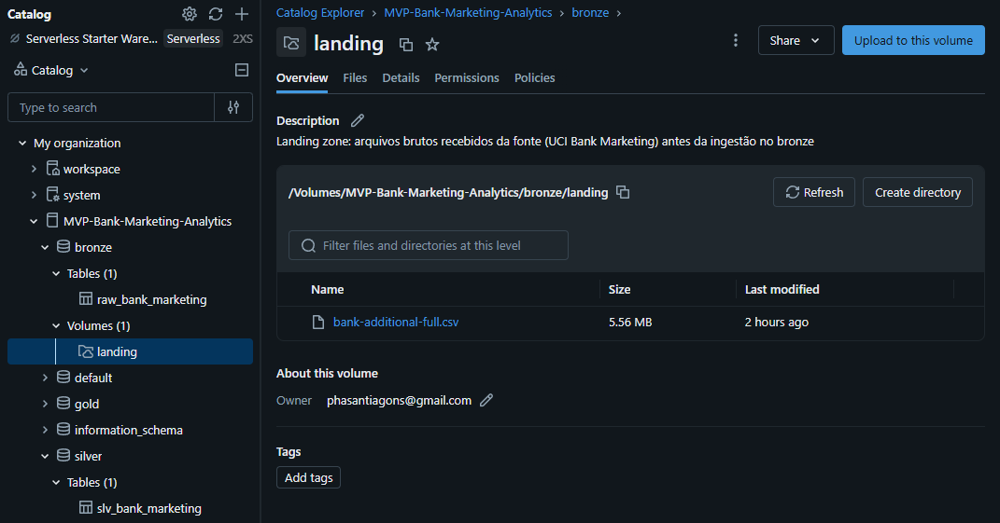
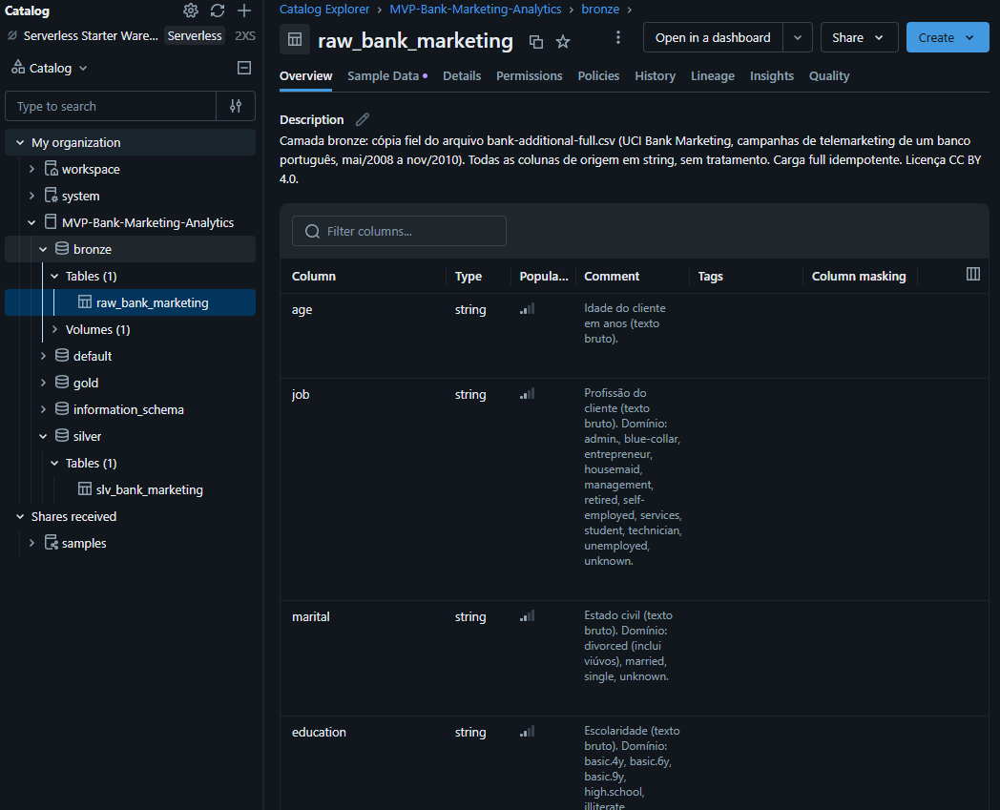

---

## 3. Modelagem e Catálogo de Dados (Etapa 4.3)

### Modelo em camadas (medalhão)

| Camada | Tabela(s) | Grão | Papel |
|---|---|---|---|
| Bronze | `raw_bank_marketing` | 1 linha do arquivo | Cópia fiel da fonte + metadados de ingestão |
| Silver | `slv_bank_marketing` | 1 cliente contatado na campanha | Dado limpo, tipado, deduplicado, validado e enriquecido (1:1 com o bronze, sem joins) |
| Gold | `dim_cliente`, `dim_campanha`, `dim_contexto_economico`, `fato_contato` | ver abaixo | Modelo dimensional para consumo analítico |

### Esquema estrela (Gold)

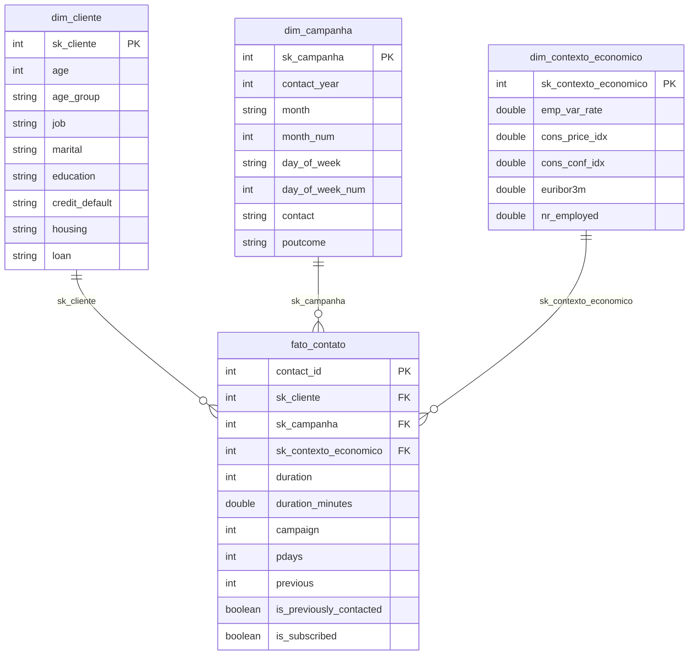
```mermaid
erDiagram
    dim_cliente ||--o{ fato_contato : "sk_cliente"
    dim_campanha ||--o{ fato_contato : "sk_campanha"
    dim_contexto_economico ||--o{ fato_contato : "sk_contexto_economico"

    fato_contato {
        int contact_id PK
        int sk_cliente FK
        int sk_campanha FK
        int sk_contexto_economico FK
        int duration
        double duration_minutes
        int campaign
        int pdays
        int previous
        boolean is_previously_contacted
        boolean is_subscribed
    }
    dim_cliente {
        int sk_cliente PK
        int age
        string age_group
        string job
        string marital
        string education
        string credit_default
        string housing
        string loan
    }
    dim_campanha {
        int sk_campanha PK
        int contact_year
        string month
        int month_num
        string day_of_week
        int day_of_week_num
        string contact
        string poutcome
    }
    dim_contexto_economico {
        int sk_contexto_economico PK
        double emp_var_rate
        double cons_price_idx
        double cons_conf_idx
        double euribor3m
        double nr_employed
    }
```

| Tabela | Linhas | Grão | Chave natural |
|---|---:|---|---|
| `fato_contato` | 41.176 | 1 cliente contatado na campanha (atributos do último contato) | `contact_id` |
| `dim_cliente` | 13.006 | 1 perfil demográfico distinto | age, job, marital, education, credit_default, housing, loan |
| `dim_campanha` | 561 | 1 combinação de ano, mês, dia, canal e resultado anterior | contact_year, month_num, day_of_week_num, contact, poutcome |
| `dim_contexto_economico` | 375 | 1 cenário macroeconômico distinto | os 5 indicadores |

**Decisões de modelagem**
- **Surrogate keys inteiras e determinísticas**, geradas com `row_number()` sobre as combinações distintas da chave natural ordenadas. Reprocessar gera as mesmas chaves.
- **`dim_cliente` é uma dimensão de perfil:** a fonte não tem ID de cliente, então clientes com atributos idênticos compartilham a linha.
- **`dim_contexto_economico`** separa os indicadores macro, que se repetem em milhares de contatos: 375 cenários para 41 mil contatos.
- **PK/FK declaradas no Unity Catalog** como constraints informativas. Elas documentam o modelo e habilitam o diagrama ER no Catalog Explorer. A integridade é garantida por checagens no pipeline.

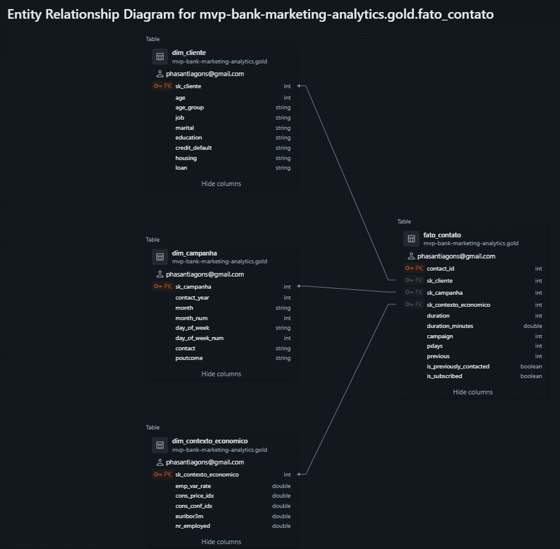

### Catálogo de dados

A documentação abaixo também está **gravada no Unity Catalog**: cada tabela e cada coluna têm comentário, aplicado pelos próprios notebooks. O catálogo é navegável no Catalog Explorer.

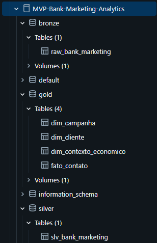

**Linhagem.** Além da coluna "Linhagem" nas tabelas abaixo, o Unity Catalog registra a linhagem **automaticamente** a cada execução do pipeline:
volume `landing` → `bronze.raw_bank_marketing` → `silver.slv_bank_marketing` → tabelas `gold`, incluindo qual notebook gerou cada tabela.

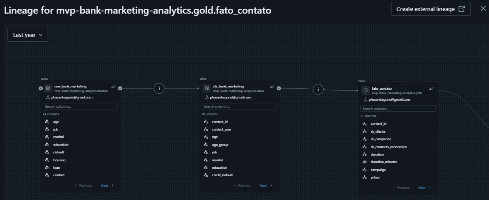

#### `silver.slv_bank_marketing`

**Descrição:** contatos de telemarketing do banco (2008-2010) limpos, tipados, deduplicados e enriquecidos. Relação 1:1 com o bronze, menos as 12 duplicatas:
41.176 linhas × 28 colunas. Grão: 1 cliente contatado na campanha. A categoria `unknown` é mantida como válida.

| Campo | Tipo | Descrição | Domínio / faixa observada | Linhagem (bronze → silver) |
|---|---|---|---|---|
| `contact_id` | int | Identificador do contato (chave única) | 1 – 41.188 (com lacunas das duplicatas removidas) | `_source_row_number` |
| `contact_year` | int | Ano do contato, **inferido** pela ordem cronológica do arquivo | 2008, 2009, 2010 | derivado de `month` + ordem das linhas |
| `age` | int | Idade do cliente | 17 – 98 | `age` → cast int |
| `age_group` | string | Faixa etária | 17-24, 25-34, 35-44, 45-54, 55-64, 65+ | derivado de `age` |
| `job` | string | Profissão | admin., blue-collar, entrepreneur, housemaid, management, retired, self-employed, services, student, technician, unemployed, unknown | `job` → trim/lower |
| `marital` | string | Estado civil (`divorced` inclui viúvos) | divorced, married, single, unknown | `marital` |
| `education` | string | Escolaridade | basic.4y, basic.6y, basic.9y, high.school, illiterate, professional.course, university.degree, unknown | `education` |
| `credit_default` | string | Possui crédito em inadimplência? | no, yes (3 casos), unknown | `default` (renomeada: palavra reservada) |
| `housing` | string | Possui financiamento imobiliário? | no, yes, unknown | `housing` |
| `loan` | string | Possui empréstimo pessoal? | no, yes, unknown | `loan` |
| `contact` | string | Canal do último contato | cellular, telephone | `contact` |
| `month` | string | Mês do último contato | mar–dec (não há jan/fev) | `month` |
| `month_num` | int | Número do mês | 3 – 12 | derivado de `month` |
| `day_of_week` | string | Dia da semana do último contato | mon, tue, wed, thu, fri | `day_of_week` |
| `day_of_week_num` | int | Número do dia (1 = mon) | 1 – 5 | derivado de `day_of_week` |
| `duration` | int | Duração do último contato (s). ⚠️ *Data leakage* | 0 – 4.918 | `duration` → cast int |
| `duration_minutes` | double | Duração em minutos (2 casas). ⚠️ *Data leakage* | 0 – 81,97 | `duration / 60` |
| `campaign` | int | Contatos com o cliente nesta campanha (inclui o último) | 1 – 56 | `campaign` |
| `pdays` | int | Dias desde o contato da campanha anterior; **NULL = sem registro** | 0 – 27 ou NULL | `pdays`, 999 → NULL |
| `previous` | int | Contatos antes desta campanha | 0 – 7 | `previous` |
| `poutcome` | string | Resultado da campanha anterior | failure, nonexistent, success | `poutcome` |
| `is_previously_contacted` | boolean | Foi contatado em campanha anterior? | true / false | derivado: `previous > 0` |
| `emp_var_rate` | double | Taxa de variação do emprego (trimestral) | −3,4 – 1,4 | `emp.var.rate` |
| `cons_price_idx` | double | Índice de preços ao consumidor (mensal) | 92,201 – 94,767 | `cons.price.idx` |
| `cons_conf_idx` | double | Índice de confiança do consumidor (mensal) | −50,8 – −26,9 | `cons.conf.idx` |
| `euribor3m` | double | Euribor 3 meses, % (diária) | 0,634 – 5,045 | `euribor3m` |
| `nr_employed` | double | Nº de empregados, milhares (trimestral) | 4.963,6 – 5.228,1 | `nr.employed` |
| `is_subscribed` | boolean | **Alvo:** aderiu ao depósito a prazo? | true (4.639) / false (36.537) | `y = 'yes'` |

#### Gold

| Tabela | Descrição |
|---|---|
| `fato_contato` | Fato de contatos: 1 linha por cliente contatado na campanha (41.176). Guarda as chaves das 3 dimensões, as métricas de esforço (`campaign`, `duration`), o histórico (`pdays`, `previous`) e o resultado (`is_subscribed`) |
| `dim_cliente` | Perfil demográfico e de crédito do cliente (13.006 perfis distintos). Como a fonte não tem ID de cliente, clientes com os mesmos atributos compartilham a linha |
| `dim_campanha` | Características do contato: ano (inferido), mês, dia da semana, canal e resultado da campanha anterior (561 combinações) |
| `dim_contexto_economico` | Cenário macroeconômico de Portugal no momento do contato: emprego, preços, confiança do consumidor e Euribor (375 cenários) |

| Tabela | Campo | Tipo | Descrição | Linhagem (silver → gold) |
|---|---|---|---|---|
| `fato_contato` | `contact_id` | int (PK) | Identificador do contato | `contact_id` |
| | `sk_cliente` | int (FK) | Referência a `dim_cliente` | lookup pela chave natural do perfil |
| | `sk_campanha` | int (FK) | Referência a `dim_campanha` | lookup pela chave natural do contato |
| | `sk_contexto_economico` | int (FK) | Referência a `dim_contexto_economico` | lookup pelos 5 indicadores |
| | `duration`, `duration_minutes` | int, double | Duração do último contato (⚠️ leakage) | idem silver |
| | `campaign`, `pdays`, `previous` | int | Esforço e histórico de contato | idem silver |
| | `is_previously_contacted`, `is_subscribed` | boolean | Flag de contato prévio e alvo | idem silver |
| `dim_cliente` | `sk_cliente` | int (PK) | Surrogate key do perfil | `row_number()` ordenado |
| | `age`, `age_group`, `job`, `marital`, `education`, `credit_default`, `housing`, `loan` | int/string | Perfil demográfico e de crédito | idem silver |
| `dim_campanha` | `sk_campanha` | int (PK) | Surrogate key do contato | `row_number()` ordenado |
| | `contact_year`, `month`, `month_num`, `day_of_week`, `day_of_week_num`, `contact`, `poutcome` | int/string | Quando, por qual canal e com qual histórico | idem silver |
| `dim_contexto_economico` | `sk_contexto_economico` | int (PK) | Surrogate key do cenário | `row_number()` ordenado |
| | `emp_var_rate`, `cons_price_idx`, `cons_conf_idx`, `euribor3m`, `nr_employed` | double | Indicadores macroeconômicos | idem silver |

#### `bronze.raw_bank_marketing`

**Descrição:** cópia fiel do arquivo `bank-additional-full.csv`, sem nenhum tratamento de conteúdo (41.188 linhas). As 21 colunas de origem ficam **com os nomes originais e tipo `string`** (ex.: `emp.var.rate`), acrescidas de `_source_row_number` (int), `_ingestion_timestamp` (timestamp) e `_source_file` (string). O significado de cada coluna é o mesmo da silver, e os domínios oficiais estão no dicionário da UCI (`bank-additional-names.txt`).

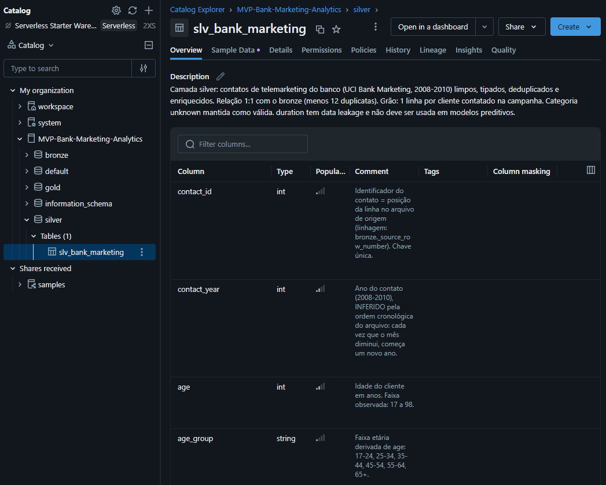

---

## 4. Pipeline de Dados (Etapa 4.4)

### Organização dos notebooks

O pipeline é **linear e modular**: um notebook por camada, mais um notebook de utilitários compartilhados. Os quatro são orquestrados por um **Databricks Job** com dependências encadeadas.

| Ordem | Notebook | Entrada | Saída | Principais operações |
|---|---|---|---|---|
| — | [`00_utils.py`](notebooks/00_utils.py) | — | — | Configuração (nomes de catálogo/tabelas), gravação de comentários no Unity Catalog, framework de qualidade `DQReport`. Carregado via `%run` |
| 1 | [`01_ingestao_bronze.py`](notebooks/01_ingestao_bronze.py) | CSV no volume `landing` | `bronze.raw_bank_marketing` | Coleta (com download de fallback), leitura bruta, metadados, validação de entrada |
| 2 | [`02_transformacao_silver.py`](notebooks/02_transformacao_silver.py) | bronze | `silver.slv_bank_marketing` | Diagnóstico, perfil de qualidade por atributo, tipagem, inferência do ano, deduplicação, derivadas, 37 checagens de qualidade, constraints `CHECK` |
| 3 | [`03_modelagem_gold.py`](notebooks/03_modelagem_gold.py) | silver | `gold.dim_*`, `gold.fato_contato` | Dimensões com surrogate keys, fato via lookup, checagens de integridade, PK/FK |
| 4 | [`04_analise.py`](notebooks/04_analise.py) | gold (star schema) | gráficos em `gold.relatorios` | Consultas das 7 perguntas, gráficos e discussão |

### Transformações: o que, por que e impacto nos dados

| Etapa | Transformação | Por quê | Impacto nos dados |
|---|---|---|---|
| Bronze | Leitura do CSV com todas as colunas como texto + 3 colunas de metadados | Preservar o dado original e garantir rastreabilidade | 41.188 linhas × 24 colunas |
| Silver | Tipagem de 10 colunas numéricas (`try_cast`) | Permitir cálculos e validações de faixa | 0 falhas de conversão |
| Silver | `contact_year` inferido pela ordem do arquivo | A fonte não tem ano, e o período afeta muito a conversão | Nova coluna: 2008 = 27.682 · 2009 = 11.436 · 2010 = 2.058 linhas |
| Silver | Remoção de duplicatas exatas (mantida a 1ª ocorrência) | 12 linhas idênticas em todas as colunas | 41.188 → 41.176 linhas |
| Silver | snake_case (`emp.var.rate` → `emp_var_rate` …) e `default` → `credit_default` | Pontos exigem crases no SQL; `DEFAULT` é palavra reservada | 5 colunas renomeadas |
| Silver | `pdays = 999` → `NULL` | 999 é código sentinela e distorceria médias e correlações | 39.661 valores → NULL |
| Silver | `is_previously_contacted = previous > 0` | `pdays` é inconsistente para 4.110 clientes (ver Qualidade) | 5.625 `true` / 35.551 `false` |
| Silver | `age_group`, `month_num`, `day_of_week_num`, `duration_minutes` | Análise por faixas, ordenação cronológica e leitura em minutos | 4 colunas novas |
| Silver | `y` → `is_subscribed` (boolean) | Alvo como booleano facilita taxas (`AVG`) | 4.639 `true` / 36.537 `false`; `y` removida |
| Silver | Remoção de `_ingestion_timestamp` e `_source_file`; `_source_row_number` → `contact_id` | Metadados não são atributos de negócio; o número da linha vira identificador com linhagem até a fonte | 28 colunas finais |
| Gold | Dimensões = combinações distintas + surrogate key | Separar descrições (dimensões) de eventos (fato) | 13.006 / 561 / 375 linhas |
| Gold | Fato = silver + *lookup* (join) das 3 surrogate keys pela chave natural | Ligar cada contato às suas dimensões | 41.176 linhas, 0 chaves órfãs |

### Orquestração

O Job `mvp_bank_marketing_pipeline` ([`jobs/pipeline_job.json`](jobs/pipeline_job.json)) roda as 4 tasks em sequência, em compute **serverless**. Uma falha em qualquer checagem crítica de qualidade interrompe a cadeia, e o dado ruim não chega às camadas seguintes.

| Task | Duração (última execução completa) |
|---|---:|
| 01_ingestao_bronze | 77 s |
| 02_transformacao_silver | 41 s |
| 03_modelagem_gold | 69 s |
| 04_analise | 116 s |

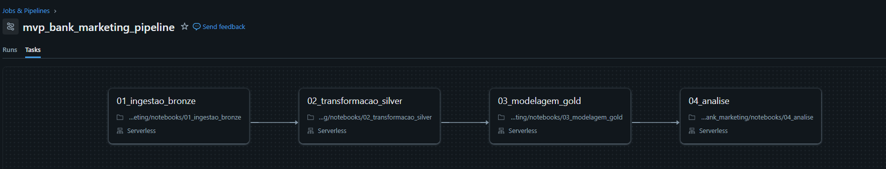
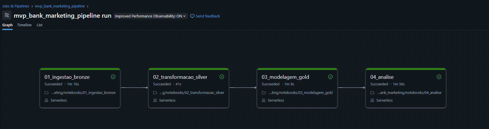

### Princípios de engenharia aplicados

- **Idempotência:** todo notebook pode ser reexecutado. As tabelas são sobrescritas; comentários, constraints `CHECK` e PK/FK só são criados se ainda não existirem, o que mantém o histórico Delta limpo.
- **Portões de qualidade:** cada camada valida o próprio resultado antes de gravar (ou logo após, na reconciliação da gold).
- **Configuração centralizada:** nomes de catálogo, schemas e tabelas vêm de um único lugar (`00_utils`).
- **Documentação como código:** o catálogo de dados é aplicado pelo pipeline, então não fica defasado em relação às tabelas.
- **Versionamento:** Delta Lake guarda o histórico de cada tabela (`DESCRIBE HISTORY` / *time travel*).

### Tabelas persistidas na nuvem

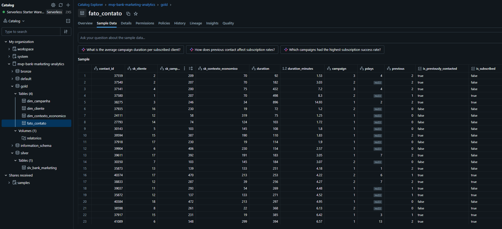
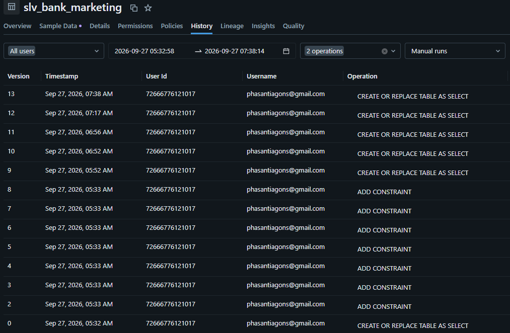

---

## 5. Qualidade de Dados (Etapa 4.5)

### Verificação por atributo

Cada um dos 21 atributos foi avaliado **no dado capturado** (antes dos tratamentos) nas cinco dimensões pedidas: completude, consistência, unicidade, acurácia e outliers.
O cálculo está no notebook [`02_transformacao_silver.py`](notebooks/02_transformacao_silver.py), seção 2.1.

- **Completude:** nulos/vazios e `unknown` (ausência de informação codificada como categoria).
- **Consistência:** valores fora do domínio documentado pela UCI (categóricos) ou que falharam na conversão para número.
- **Unicidade:** nº de valores distintos. Não há chave natural na fonte; a unicidade de linha (duplicatas) está no problema nº 1 abaixo.
- **Acurácia:** valores fora de uma faixa plausível (ex.: idade entre 17 e 100; Euribor entre 0% e 10%).
- **Outliers:** numéricos pela regra do IQR, fora de [Q1 − 1,5·IQR ; Q3 + 1,5·IQR]; categóricos como categorias raras (< 0,5% das linhas).

| Atributo | Completude | Consistência | Distintos | Acurácia | Outliers | Decisão |
|---|---|---|---:|---|---|---|
| `age` | 0 nulos | 0 falhas | 78 | 17–98, ok | 469 (1,1%) acima de 69,5 anos | Mantidos: clientes idosos reais, segmento relevante (65+) |
| `job` | 0 nulos · 0,8% `unknown` | 0 fora do domínio | 12 | ok | — | `unknown` mantido |
| `marital` | 0 nulos · 0,2% `unknown` | 0 | 4 | ok | rara: `unknown` (80) | Mantido |
| `education` | 0 nulos · 4,2% `unknown` | 0 | 8 | ok | rara: `illiterate` (18) | Mantida; omitida nas taxas da P2 por n < 100 |
| `default` | 0 nulos · **20,9% `unknown`** | 0 | 3 | ok | rara: `yes` (3) | Renomeada `credit_default`; `unknown` informativo |
| `housing` | 0 nulos · 2,4% `unknown` | 0 | 3 | ok | — | Mantido |
| `loan` | 0 nulos · 2,4% `unknown` | 0 | 3 | ok | — | Mantido |
| `contact` | 0 nulos | 0 | 2 | ok | — | — |
| `month` | 0 nulos | 0 | 10 | ok (não há jan/fev) | rara: `dec` (182) | Mantido; `month_num` criado |
| `day_of_week` | 0 nulos | 0 | 5 | ok (só dias úteis) | — | `day_of_week_num` criado |
| `duration` | 0 nulos | 0 falhas | 1.544 | 0–4.918 s, ok | 2.963 (7,2%) acima de 644 s | Mantidos; variável com *leakage*, só descritiva |
| `campaign` | 0 nulos | 0 falhas | 42 | 1–56, ok | 2.406 (5,8%) acima de 6 contatos | Mantidos; análise por faixas (6-10, 11+) |
| `pdays` | 0 nulos · **96,3% = 999** (sentinela) | **4.110 conflitos com `previous`** | 27 | 0–27 (+ 999), ok | 82 acima de 13 dias (entre os 1.515 com registro) | 999 → NULL; flag de contato prévio via `previous` |
| `previous` | 0 nulos | 0 falhas | 8 | 0–7, ok | IQR degenerado (Q1 = Q3 = 0): os 5.625 valores > 0 | Não são outliers: são o grupo "já contatado" |
| `poutcome` | 0 nulos | 0; 100% coerente com `previous` | 3 | ok | — | — |
| `emp.var.rate` | 0 nulos | 0 falhas | 10 | −3,4 a 1,4, ok | 0 | — |
| `cons.price.idx` | 0 nulos | 0 falhas | 26 | 92,2 a 94,8, ok | 0 | — |
| `cons.conf.idx` | 0 nulos | 0 falhas | 26 | −50,8 a −26,9, ok | 447 (1,1%) com −26,9 | Mantidos: valor real do índice num período específico |
| `euribor3m` | 0 nulos | 0 falhas | 316 | 0,63% a 5,05%, ok | 0 (distribuição bimodal: ~1% e ~4,9%) | — |
| `nr.employed` | 0 nulos | 0 falhas | 11 | 4.963,6 a 5.228,1, ok | 0 | — |
| `y` | 0 nulos | 0 | 2 | ok | — | Classe desbalanceada (11,3% `yes`); vira `is_subscribed` |

**Leitura:** a base não tem nulos explícitos nem valores fora do domínio. Os problemas reais são **semânticos**: a ausência de informação codificada como `unknown` ou `999`, a inconsistência entre `pdays` e `previous`, as duplicatas e a falta de ano. Os outliers encontrados são valores legítimos do negócio, por isso nenhum foi removido; as análises usam faixas para que eles não distorçam os resultados.


### Problemas detectados e tratamentos

| # | Problema | Evidência | Tratamento |
|---|---|---|---|
| 1 | **Linhas duplicadas** | 12 pares idênticos em todas as 21 colunas, inclusive a duração em segundos | Removidas; mantida a 1ª ocorrência (41.188 → 41.176) |
| 2 | **`pdays` inconsistente com `previous`** | 4.110 linhas com `pdays = 999` ("não contatado") mas `previous > 0`, todas com `poutcome = failure`. `pdays` só vai de 0 a 27. No `bank-full.csv` original (sem os indicadores) a inconsistência não existe | `999 → NULL`, com significado **"sem registro de dias"**. A flag `is_previously_contacted` usa `previous > 0`, que coincide 100% com `poutcome <> 'nonexistent'` (35.563 = 35.563) |
| 3 | **Valores `unknown`** | 10.698 linhas (26%) com `unknown` em algum atributo; 8.596 só em `credit_default` | Mantido como **categoria válida** (recomendação da UCI). Excluir enviesaria a base e imputar criaria informação inexistente. Na análise, `credit_default = unknown` se mostrou informativo |
| 4 | **Idade abaixo da faixa pedida** | 5 clientes com 17 anos | Primeira faixa etária definida como **17-24** |
| 5 | **Sem coluna de ano** | A UCI declara o arquivo ordenado de mai/2008 a nov/2010 | `contact_year` **inferido**: cada vez que o mês "volta" (ex.: dez → mar) começa um novo ano. Exatamente 2 viradas, confirmando a premissa |
| 6 | **`duration` com data leakage** | Só é conhecida após a ligação; `duration = 0` implica `y = no` | Mantida só como informação descritiva, com aviso no catálogo |
| 7 | **`duration = 0`** | 4 ligações | Mantidas (ligação não completada) |
| 8 | **Classe quase vazia** | `credit_default = yes` em apenas 3 linhas | Mantida e documentada (baixa variância) |
| 9 | **Outliers de esforço** | `campaign` até 56; `duration` até 4.918 s | Mantidos (plausíveis); a análise usa faixas |
| 10 | **Nomes de coluna problemáticos** | Pontos (`emp.var.rate`) e palavra reservada (`default`) | snake_case e `default → credit_default` |
| 11 | **Colunas numéricas como texto** | Todas as colunas chegam como string | Tipagem com `try_cast` e verificação de que nenhum valor falhou na conversão |

### Framework de validação

O pipeline usa um relatório de qualidade próprio ([`DQReport`](notebooks/00_utils.py)) com dois níveis:

- **Críticas** (`FALHA` interrompe o pipeline): volume, unicidade, tipagem, nulos, **domínios categóricos**, **faixas numéricas**, consistência entre colunas (`previous` × `poutcome`, `duration = 0` × adesão) e integridade referencial.
- **Problemas conhecidos** (`ALERTA` se o volume mudar): o valor esperado é o volume documentado (ex.: 4.110 conflitos de `pdays`), o que permite **detectar mudanças na fonte** sem bloquear a carga.

| Camada | Checagens | Exemplos |
|---|---:|---|
| Bronze | 5 | nº de linhas, layout de colunas, ordem preservada |
| Silver | 37 | 10 conversões numéricas, 10 domínios, 6 faixas, 3 regras de consistência, 5 problemas conhecidos |
| Gold | 16 | fato = silver, FK nula, SK/chave natural duplicada, órfãos, taxa de conversão silver = gold |

Além das checagens, a silver tem **7 constraints `CHECK` do Delta Lake** (ex.: `campaign >= 1`, `month_num BETWEEN 1 AND 12`), que rejeitam qualquer escrita futura inválida. Todas as checagens passaram na última execução.


---

## 6. Análise de Dados (Etapa 4.5)

**Script:** [`notebooks/04_analise.py`](notebooks/04_analise.py). Todas as consultas partem do **esquema estrela** (fato + 3 dimensões). **Taxa geral de conversão: 11,27%** (4.639 adesões em 41.176 contatos).

Cada pergunta traz o gráfico gerado pelo pipeline e o **print da consulta executada no Databricks**, como evidência do resultado.

### P1 — Taxa geral e canal de contato

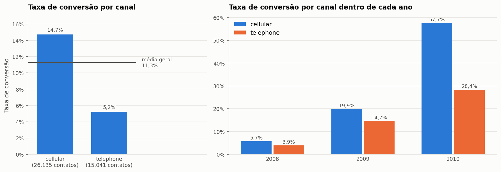

- O **celular converte 2,8× mais** que o telefone fixo: **14,7% × 5,2%**.
- A vantagem se mantém **dentro de cada ano** (2008: 5,7% × 3,9%; 2009: 19,9% × 14,7%; 2010: 57,7% × 28,4%), então não é efeito do período.
- **Ação:** celular como canal padrão; fixo só como alternativa.

**Evidência no Databricks (P1):**


### P2 — Perfil demográfico

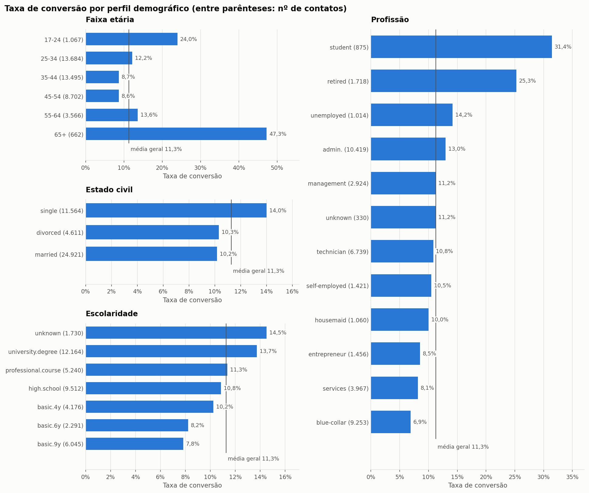

- **Idade em "U":** 17-24 (24,0%) e 65+ (47,3%) bem acima da média; 35-54 anos (~8,7%) abaixo, e é nessa faixa que estão 54% dos contatos.
- **Profissão:** student (31,4%) e retired (25,3%) no topo; **blue-collar** (6,9%) é a pior, apesar de ser o 2º maior volume.
- **Escolaridade e estado civil:** efeito moderado (curso superior 13,7%; solteiros 14,0%).
- ⚠️ **Controle por período:** nenhum cliente 65+ foi contatado em 2008, o pior ano. Dentro de cada ano a vantagem persiste (em 2009: 65+ 40,7%, aposentados 36,5% e estudantes 32,1%, contra média de 19,5%), mas o *lift* real fica em ~1,5–2×, não os 3–4× da visão bruta.

**Evidência no Databricks (P2):**


### P3 — Número de contatos na campanha

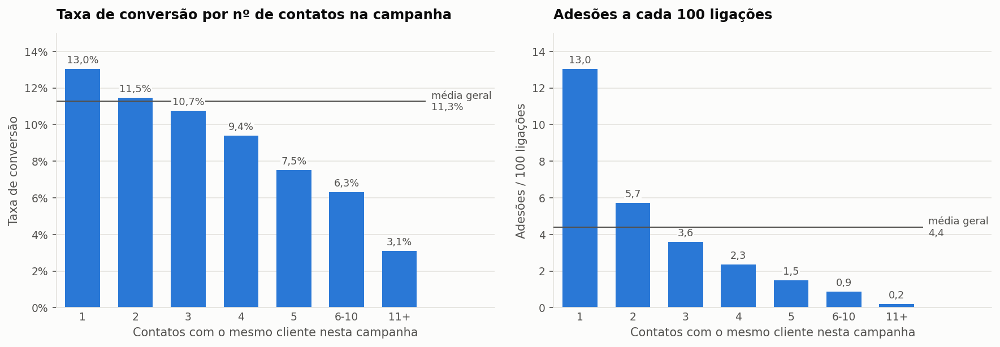

- **Impacto negativo e monotônico:** de 13,0% (1 contato) para 3,1% (11+).
- **88% das adesões ocorrem até o 3º contato.** Clientes com 6+ contatos consumiram **30,6% das ligações** para gerar só **4,0% das adesões**.
- **Ação:** teto de **3 tentativas** por cliente. Isso libera ~26% das ligações, abrindo mão de no máximo 12% das adesões, e as ligações liberadas podem ir para clientes novos de perfil prioritário.

**Evidência no Databricks (P3):**


### P4 — Contato em campanhas anteriores

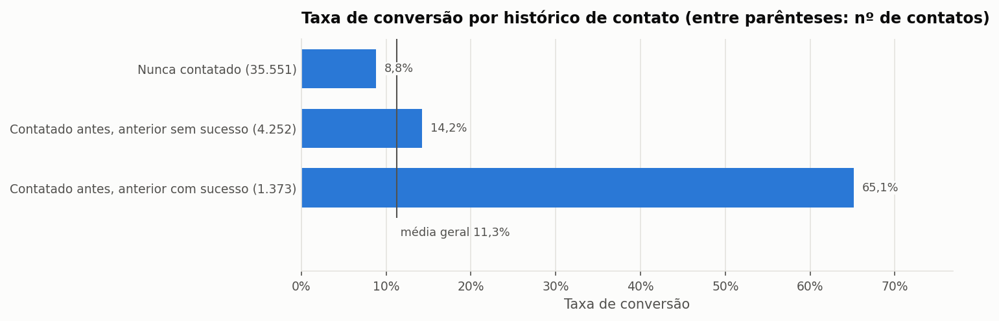

- Já contatados convertem **26,7%**, contra **8,8%** dos novos (3×). Ex-aderentes convertem **65,1%** (*lift* 5,8).
- O tratamento correto de `pdays` (problema de qualidade nº 2) foi decisivo aqui: com a flag baseada em `pdays`, 4.110 clientes já contatados seriam contados como "novos".

**Evidência no Databricks (P4):**


### P5 — Mês e dia da semana

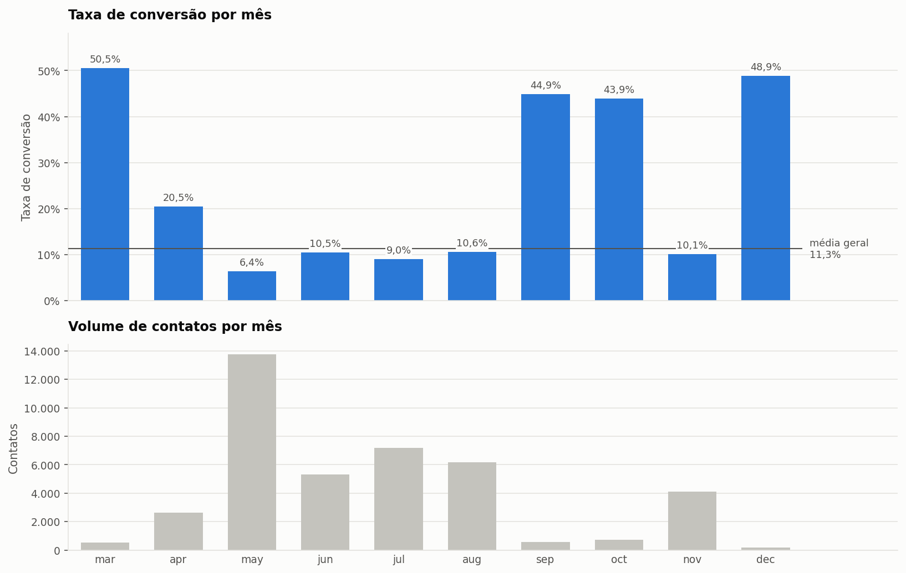
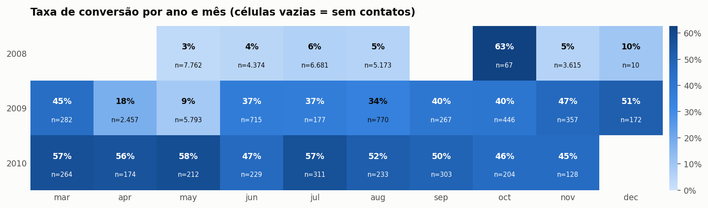

- Março, setembro, outubro e dezembro têm taxas de 44–51%, mas são os meses de **menor volume**. Maio (33% dos contatos) tem 6,4%.
- O mapa ano × mês mostra que o **"efeito mês" é efeito de período**: em 2008 os meses com volume relevante ficaram entre 3,1% e 6,1% (as exceções, outubro e dezembro, tiveram só 67 e 10 contatos); de junho de 2009 em diante, todos os meses passaram de 34%. O padrão consistente é que **ondas massivas convertem pior**.
- **Dia da semana:** ter–qui (11,7–12,1%) ligeiramente acima; segunda é o pior dia (10,0%).

**Evidência no Databricks (P5):**


### P6 — Indicadores econômicos

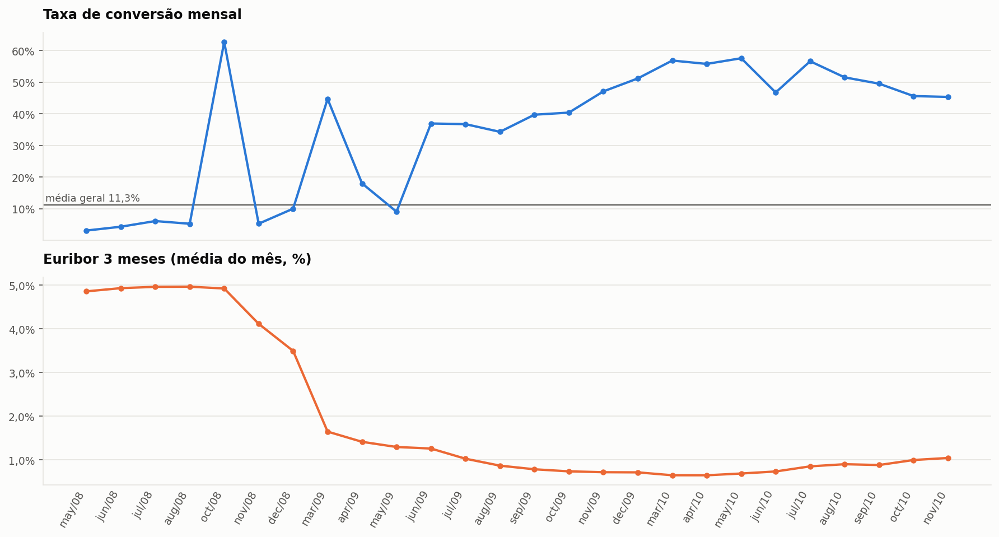
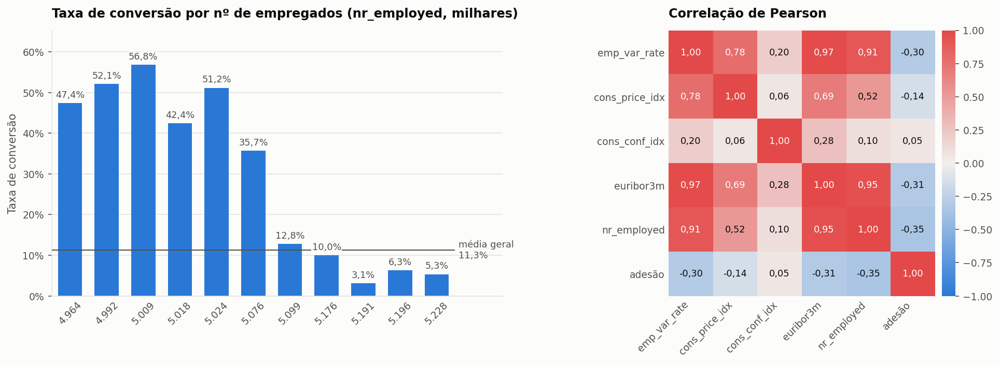

- **Associação forte:** Euribor < 1% → 45,7% de conversão; ≥ 4% → 4,8%. Correlação com a adesão: `nr_employed` −0,35, `euribor3m` −0,31, `emp_var_rate` −0,30; `cons_conf_idx` ≈ 0.
- Os indicadores são **altamente colineares** (Euribor × nr_employed = 0,95) e medem o mesmo ciclo: a crise de 2008 e a queda dos juros.
- **Cautela causal:** no mesmo período o banco mudou a operação (volume de 27,7 mil → 2,1 mil contatos/ano, mais celular, mais recontato). O resultado é **associação, não causalidade**. Uso prático: **calibrar volume e metas** conforme o ciclo de juros.

**Evidência no Databricks (P6):**


### P7 — Perfil ideal

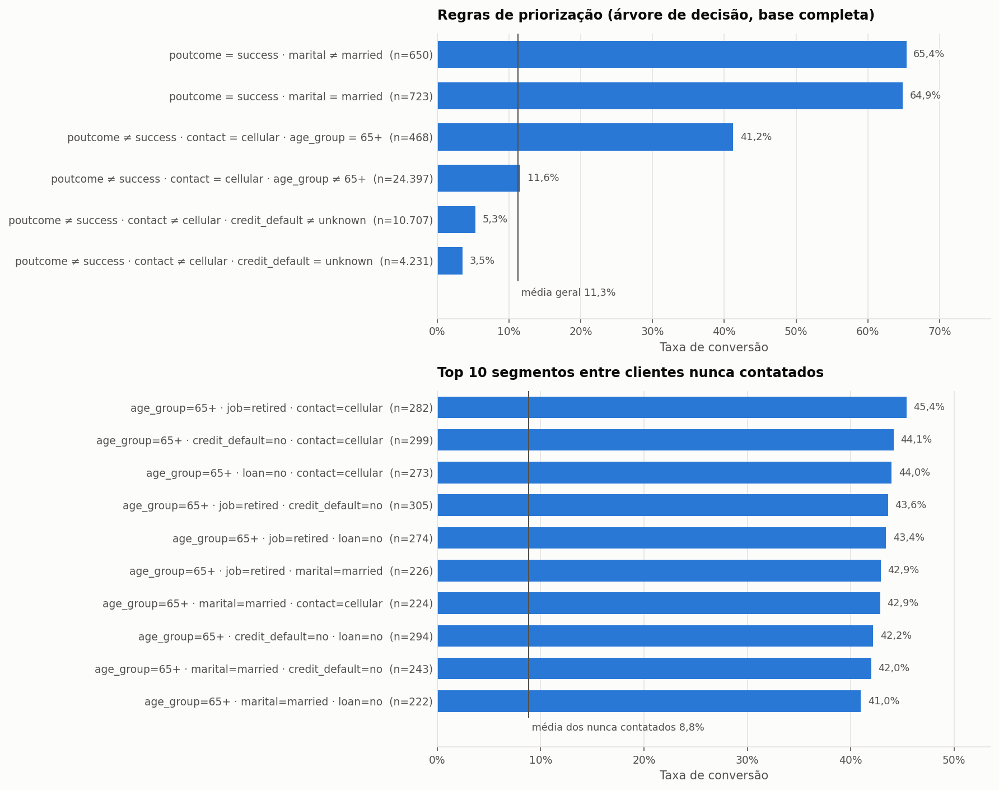

Árvore de decisão (profundidade 3, **sem `duration`** e sem variáveis de período; AUC 0,68 em teste) e ranking de segmentos com suporte mínimo de 200 contatos:

| Prioridade | Perfil | Conversão |
|---|---|---:|
| 1 | Aderiu na campanha anterior | ~65% |
| 2 | Sem sucesso anterior, 65+ (em especial aposentados), contato por celular | 41–45% |
| 3 | Sem sucesso anterior, celular, menos de 65 anos (priorizar jovens/estudantes e curso superior) | ~12% |
| 4 | Contato só por telefone fixo | 3,5–5,3% |

**Regras operacionais:** celular, até 3 tentativas, terça a quinta, sem ondas massivas. Antes de escalar, validar com **teste A/B**.

**Evidência no Databricks (P7):**


### Conclusão

Os fatores **controláveis** que mais influenciam a conversão são o **histórico de relacionamento**, o **canal** e o **esforço por cliente**. O **perfil demográfico** ajuda a priorizar os clientes novos. O **contexto macroeconômico** muda o patamar da conversão e serve para calibrar metas, não como alavanca.

---

## 7. Autoavaliação

### Atingimento dos objetivos

| Objetivo | Situação |
|---|---|
| Pipeline em nuvem, de ponta a ponta, na arquitetura medalhão | ✅ Bronze → Silver → Gold no Databricks, orquestrado por Job |
| Modelagem dimensional | ✅ Esquema estrela com surrogate keys e PK/FK no Unity Catalog |
| Catálogo de dados | ✅ Documentado no README **e** gravado no Unity Catalog (todas as tabelas e colunas) |
| Qualidade de dados | ✅ Verificação dos 21 atributos nas 5 dimensões; 11 problemas identificados e tratados; 58 checagens automatizadas; constraints Delta |
| Responder às 7 perguntas | ✅ 5 respondidas e ⚠️ 2 respondidas parcialmente (detalhe abaixo) |

### Atingimento por pergunta

As perguntas originais foram mantidas intactas. Algumas só puderam ser respondidas em parte:

| # | Situação | Discussão |
|---|---|---|
| P1 | ✅ Respondida | Taxa geral e diferença por canal medidas e confirmadas dentro de cada ano |
| P2 | ✅ Respondida, com ressalva | Os perfis mais propensos foram identificados, mas a visão bruta superestimava o efeito, porque idosos e estudantes foram contatados quase só em 2009-2010. O controle por ano corrigiu isso. Sem ID de cliente, o "perfil" é uma combinação de atributos, não um cliente |
| P3 | ✅ Respondida | Relação clara e monotônica. Parte do efeito é seleção (clientes pouco interessados exigem mais ligações), o que não muda a recomendação operacional |
| P4 | ✅ Respondida | Resposta forte, e só foi possível depois de corrigir a interpretação de `pdays` |
| P5 | ⚠️ Parcial | **Não foi possível apontar um "melhor mês" confiável:** mês, ano e volume de contatos estão confundidos, e cada mês aparece em poucos anos, com volumes muito diferentes. Para os dias da semana, as diferenças são pequenas. Uma resposta robusta exigiria mais anos de campanhas com volume semelhante por mês |
| P6 | ⚠️ Parcial | A **associação** entre indicadores e conversão foi demonstrada, mas a **influência** (causalidade) não pôde ser comprovada. Os 5 indicadores são colineares e variam junto com mudanças na operação do banco (volume, canal, recontato). Com dados observacionais de um único ciclo econômico não dá para separar os efeitos |
| P7 | ✅ Respondida (descritiva) | Ranking e regras de priorização foram gerados, mas o poder discriminativo do perfil é moderado (AUC 0,68) e o resultado precisa ser validado com teste A/B antes de virar política |

### Dificuldades encontradas

- **Inconsistência de `pdays`:** a documentação diz que 999 significa "nunca contatado", mas 4.110 registros contradizem isso. Foi preciso investigar e comparar com a versão original do dataset (`bank-full.csv`) antes de decidir o tratamento. Sem essa investigação, a resposta da P4 estaria errada.
- **Ausência de identificador de cliente e de ano:** exigiu soluções de modelagem (dimensão de perfil) e de engenharia (inferir o ano pela ordem do arquivo, preservada desde o bronze).
- **Confusão temporal na análise:** a conversão vai de 4,8% (2008) a 52,1% (2010). Várias conclusões "óbvias" (melhor mês, lift de idosos) mudaram depois de controlar o período. Foi o aprendizado analítico mais importante do projeto.
- **Limitações do Free Edition / serverless:** `input_file_name()` e cache de DataFrame não são suportados, o que levou ao uso da coluna `_metadata` e ao cálculo das checagens de qualidade numa única agregação.

### Autoavaliação

**O objetivo central foi atingido em grande parte.** O projeto se propôs a identificar os fatores que mais influenciam a conversão, para otimizar a alocação do esforço de contato. Ao final, esses fatores estão identificados e ordenados por força e pela capacidade do banco de agir sobre eles. O mais forte é o histórico de relacionamento: ex-aderentes convertem 65,1%, contra 8,8% dos clientes novos. Em seguida vêm o canal, com o celular convertendo 2,8× mais que o fixo, e o esforço por cliente, já que 88% das adesões acontecem até o 3º contato. O perfil demográfico pesa menos. Cada fator virou uma recomendação operacional concreta.

**Frente às decisões de negócio planejadas no início** (tabela de [planejamento](#planejamento-como-cada-pergunta-será-respondida)):
- **Atingidas (5):** canal padrão (P1), segmentos a priorizar (P2), teto de tentativas (P3), lista quente (P4) e ranking de priorização (P7). Para essas decisões, os dados deram uma resposta clara, que se manteve depois de controlar o efeito do período.
- **Atingidas em parte (2):** o calendário de contatos (P5) ficou limitado a recomendações fracas (evitar a segunda-feira e ondas massivas), porque não foi possível separar o efeito do mês do efeito do período. A calibração do volume pelo ciclo econômico (P6) é viável como uso de uma associação, mas não consegui afirmar que os indicadores *influenciam* a decisão do cliente, como a pergunta pedia.

**O que não foi possível entregar, e por quê:** uma estimativa de quanto a conversão subiria com as recomendações aplicadas. Isso exigiria um experimento controlado ou dados de campanhas posteriores, que o dataset não tem. As recomendações estão bem fundamentadas nos dados históricos, mas o ganho esperado não está quantificado.

**Sobre o processo:** as perguntas definidas no início orientaram as decisões de engenharia, e isso mudou o resultado. Preservar a ordem das linhas desde o bronze permitiu reconstruir o ano; sem ele, as conclusões de P2 e P5 estariam erradas. Investigar o `pdays` antes de criar a flag de contato prévio evitou uma resposta incorreta na P4. Considero que o MVP cumpriu o seu papel: é um pipeline funcional, de ponta a ponta, que responde de forma confiável à maioria das perguntas e deixa claro onde os dados não permitem ir além.

---

## Como reproduzir

1. Crie no Unity Catalog o catálogo `mvp-bank-marketing-analytics` com os schemas `bronze`, `silver` e `gold` (ou ajuste `CATALOG` em [`00_utils.py`](notebooks/00_utils.py)).
   Por causa do hífen, o nome do catálogo precisa de crases em SQL (ex.: ``SELECT * FROM `mvp-bank-marketing-analytics`.gold.fato_contato``).
2. Importe a pasta `notebooks/` para o workspace:
   ```bash
   databricks workspace import-dir notebooks /Workspace/Users/<seu-usuario>/mvp_bank_marketing/notebooks
   ```
3. (Opcional) Envie o CSV para o volume `bronze.landing`. Sem isso, o notebook 01 baixa o arquivo da UCI.
4. Crie o Job substituindo `{{NOTEBOOKS_DIR}}` em [`jobs/pipeline_job.json`](jobs/pipeline_job.json) pelo caminho do passo 2 e execute:
   ```bash
   databricks jobs create --json @pipeline_job.json
   databricks jobs run-now <job_id>
   ```
   Ou execute os notebooks 01 → 04 manualmente, em ordem.

---

## Referências

- Moro, S., Cortez, P., & Rita, P. (2014). A Data-Driven Approach to Predict the Success of Bank Telemarketing. *Decision Support Systems*, 62, 22–31. https://doi.org/10.1016/j.dss.2014.03.001
- Moro, S., Rita, P., & Cortez, P. (2014). *Bank Marketing* [Dataset]. UCI Machine Learning Repository. https://doi.org/10.24432/C5K306
- Databricks. *Medallion architecture*. https://docs.databricks.com/aws/en/lakehouse/medallion
- Databricks. *Unity Catalog — constraints*. https://docs.databricks.com/aws/en/tables/constraints
- Kimball, R., & Ross, M. (2013). *The Data Warehouse Toolkit* (3rd ed.). Wiley.
